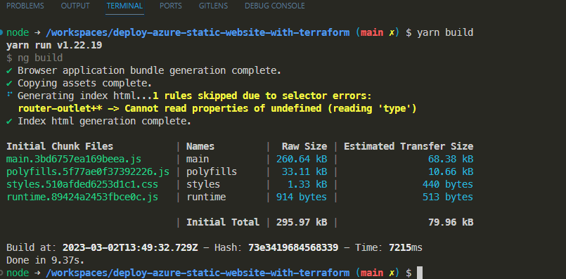
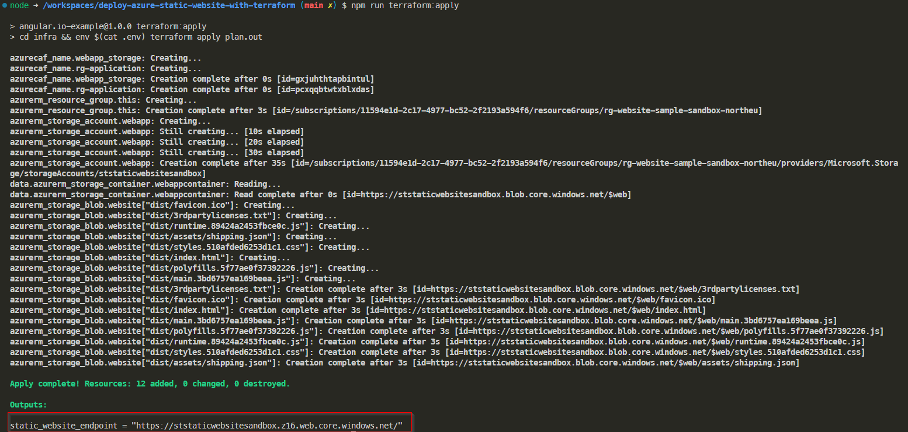
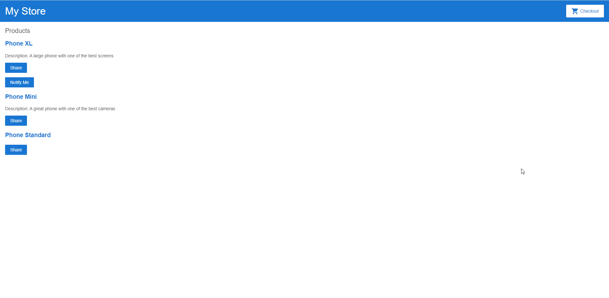

# Azure Static Website Sample with Azure Storage Account


## Purpose of the project

This sample project shows how to deploy an angular web site on a cloud storage with terraform. You may consider this as a starter point if you wish to have a repo that both have the website angular source code and the infrastructure.

To get more information on the azure feature refers to [https://learn.microsoft.com/en-us/azure/storage/blobs/storage-blob-static-website](https://learn.microsoft.com/en-us/azure/storage/blobs/storage-blob-static-website) that will gives you a fully detailed documentation.

## Requirements

### Dev Containers based project

The project is shipped with a dev container so you simply have to clone it and open the project in a dev container with vscode. To get more information on that please visit: [https://code.visualstudio.com/docs/devcontainers/containers](https://code.visualstudio.com/docs/devcontainers/containers).

### Create a storage account in your azure subscription

In your azure subscription create a storage account and a private blob storage that will be used to store your remote backend. Your will find the procedure here : [https://learn.microsoft.com/en-us/azure/storage/common/storage-account-create?tabs=azure-portal](https://learn.microsoft.com/en-us/azure/storage/common/storage-account-create?tabs=azure-portal).

Edit the file in /infra/backend.tfvars with your storage account information.

```bash
resource_group_name  = "rg-launchpad" # to be replace with the resource group where your create your storage account
storage_account_name = "stlaunchpadsandbox" # Put your storage account name
container_name       = "tfstate"
key                  = "angular-sample-app.terraform.tfstate"
```

### Create a service principal to deploy to azure

Create a service principal that will be used within your terraform init and plan phase. That service principal must have `contributor` role within your subscription.
The procedure to create that service principal is located here: [https://registry.terraform.io/providers/hashicorp/azurerm/latest/docs/guides/service_principal_client_secret](https://registry.terraform.io/providers/hashicorp/azurerm/latest/docs/guides/service_principal_client_secret)

You need to set some environment variables in your sheel scripts to be automatically logged in to azure with terrafrom. Those environment variables are:

| environment variable | description                           |
| -------------------- | ------------------------------------- |
| ARM_CLIENT_SECRET    | your service principal client secret  |
| ARM_CLIENT_ID        | your service principal application id |
| ARM_TENANT_ID        | Your tenant id                        |
| ARM_SUBSCRIPTION_ID  | your subscription id                  |

Create a `.env` file the `infra` repository. You will have to dotsource that file in each terminal you use.

The file must be set like this:

```bash
ARM_CLIENT_SECRET=xxxxxxxxxxxxxxxxxxxxxxxxxxxxxxx
ARM_CLIENT_ID=xxxxxxxxxxxxxxxxxxxxxxxxxxxxxxx
ARM_TENANT_ID=xxxxxxxxxxxxxxxxxxxxxxxxxxxxxxx
ARM_SUBSCRIPTION_ID=xxxxxxxxxxxxxxxxxxxxxxxxxxxxxxx
```


## Build the websites

As usual with angular you need to build your website to produce the transpiled javascript that will be published on your web server (here in your cloud storage). 

To do so, you simply have to run the follwing command in a terminal of your dev container.

```bash
yarn build
```

You must have the folling result



## Deploy the web site

And the magic happen. All you need to do is to perform the 3 main steps of the terraform deployment:

1- terraform init 
2- terraform plan 
3- terraform apply

I wrapped everything in the package.json file for you so you simply have to run the command like shown below to get all the parameters done.

```bash
npm run terraform:init
npm run terrforn:plan
npm run terraform:apply
```

After the deployment everything must be deployed and you simply have to browse your Static Website. To kown which is the associated url, you simple have to read the result of your apply command as terraform output the url as shown below:



## And here is the result

if you open your browser you can "normaly" see the website like this:




## Dont forget to clean your stuff

You simply have to run the command 

```bash
npm run destroy
```
